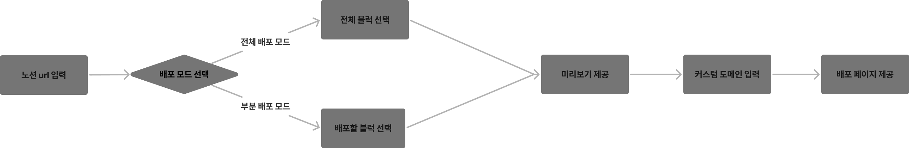
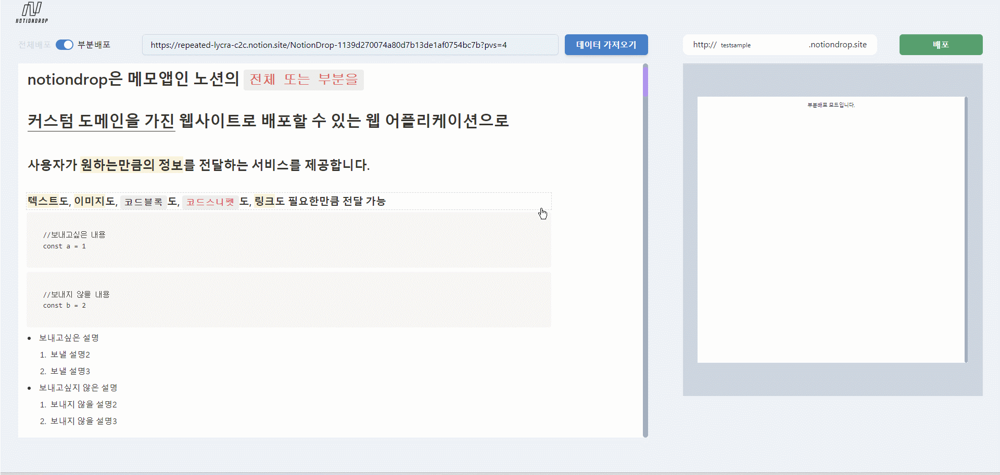
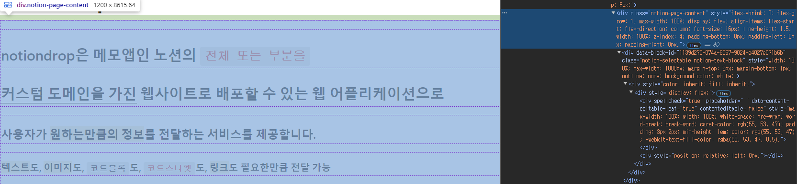
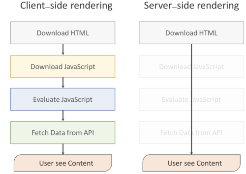
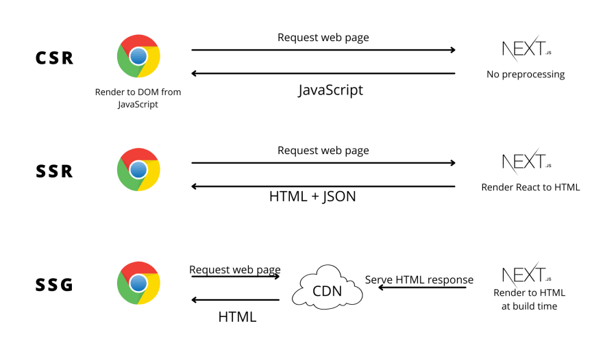
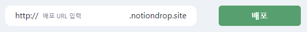
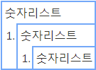
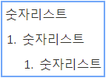
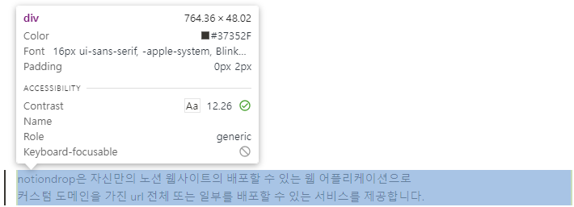
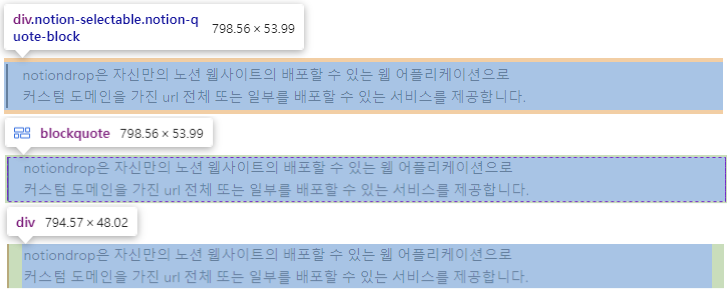

  
  
  
  
   
  
  
  
  
    

<a href="http://notiondrop.eba-a7ppf4xy.ap-northeast-2.elasticbeanstalk.com/" target="_blank">배포 링크 바로가기</a>

# NotionDrop

> 메모앱인 노션의 페이지 전체 또는 부분을 배포하여 사용자가 원하는만큼의 정보를 전달하는 서비스를 제공합니다.

#### 사용예시) 노션 컨텐츠 중 원하는 블럭만 선택하여 배포 → [예시 샘플 확인하기](http://testsample.notiondrop.site)

## 목차

- [1. 기획동기](#1-%EA%B8%B0%ED%9A%8D%EB%8F%99%EA%B8%B0)

- [2. 핵심기술 개요](#2-%ED%95%B5%EC%8B%AC%EA%B8%B0%EC%88%A0-%EA%B0%9C%EC%9A%94)

  - [2-1. 노션 페이지에서 추출한 html태그를 SSR방식으로 렌더링하기](#2-1-%EB%85%B8%EC%85%98-%ED%8E%98%EC%9D%B4%EC%A7%80%EC%97%90%EC%84%9C-%EC%B6%94%EC%B6%9C%ED%95%9C-html%ED%83%9C%EA%B7%B8%EB%A5%BC-ssr%EB%B0%A9%EC%8B%9D%EC%9C%BC%EB%A1%9C-%EB%A0%8C%EB%8D%94%EB%A7%81%ED%95%98%EA%B8%B0)
  - [2-2. 부분 배포 모드의 경우 선택한 블럭만 지정해서 SSG 생성하기](#2-2-%EB%B6%80%EB%B6%84-%EB%B0%B0%ED%8F%AC-%EB%AA%A8%EB%93%9C%EC%9D%98-%EA%B2%BD%EC%9A%B0-%EC%84%A0%ED%83%9D%ED%95%9C-%EB%B8%94%EB%9F%AD%EB%A7%8C-%EC%A7%80%EC%A0%95%ED%95%B4%EC%84%9C-ssg-%EC%83%9D%EC%84%B1%ED%95%98%EA%B8%B0)
  - [2-3. Vercel을 활용한 서브도메인 부여](#2-3-vercel%EC%9D%84-%ED%99%9C%EC%9A%A9%ED%95%9C-%EC%84%9C%EB%B8%8C%EB%8F%84%EB%A9%94%EC%9D%B8-%EB%B6%80%EC%97%AC)

- [3. 챌린지](#3-%EC%B1%8C%EB%A6%B0%EC%A7%80)

  #### 모든 챌린지는 ①문제 정의 → ②접근 방식 → ③해결 방안 순으로 정리했습니다.

  - [3-1. 노션 컨텐츠를 어떻게 가져오는게 최선일까?](#3-1-%EB%85%B8%EC%85%98-%EC%BB%A8%ED%85%90%EC%B8%A0%EB%A5%BC-%EC%96%B4%EB%96%BB%EA%B2%8C-%EA%B0%80%EC%A0%B8%EC%98%A4%EB%8A%94%EA%B2%8C-%EC%B5%9C%EC%84%A0%EC%9D%BC%EA%B9%8C)
    - [1. 문제정의: 꼭 노션API를 사용해야만 할까?](#1-%EB%AC%B8%EC%A0%9C%EC%A0%95%EC%9D%98-%EA%BC%AD-%EB%85%B8%EC%85%98api%EB%A5%BC-%EC%82%AC%EC%9A%A9%ED%95%B4%EC%95%BC%EB%A7%8C-%ED%95%A0%EA%B9%8C)
    - [2. 접근 방식 : 가장 재현도가 높은 방식은 "스냅샷"](#2-%EC%A0%91%EA%B7%BC-%EB%B0%A9%EC%8B%9D--%EA%B0%80%EC%9E%A5-%EC%9E%AC%ED%98%84%EB%8F%84%EA%B0%80-%EB%86%92%EC%9D%80-%EB%B0%A9%EC%8B%9D%EC%9D%80-%EC%8A%A4%EB%83%85%EC%83%B7)
    - [3. 해결방안 : `Puppeteer`로 구현한 SSR](#3-%ED%95%B4%EA%B2%B0%EB%B0%A9%EC%95%88--puppeteer%EB%A1%9C-%EA%B5%AC%ED%98%84%ED%95%9C-ssr)
  - [3-2. 부분 배포 시 블럭선택의 기준은 어떻게 정하는게 직관적일까?](#3-2-%EB%B6%80%EB%B6%84-%EB%B0%B0%ED%8F%AC-%EC%8B%9C-%EB%B8%94%EB%9F%AD%EC%84%A0%ED%83%9D%EC%9D%98-%EA%B8%B0%EC%A4%80%EC%9D%80-%EC%96%B4%EB%96%BB%EA%B2%8C-%EC%A0%95%ED%95%98%EB%8A%94%EA%B2%8C-%EC%A7%81%EA%B4%80%EC%A0%81%EC%9D%BC%EA%B9%8C)
    - [1. 문제 정의 : 개별 블럭을 일일이 선택하는건 너무 번거로워 사용자 경험에 좋지 않다.](#1-%EB%AC%B8%EC%A0%9C-%EC%A0%95%EC%9D%98--%EA%B0%9C%EB%B3%84-%EB%B8%94%EB%9F%AD%EC%9D%84-%EC%9D%BC%EC%9D%BC%EC%9D%B4-%EC%84%A0%ED%83%9D%ED%95%98%EB%8A%94%EA%B1%B4-%EB%84%88%EB%AC%B4-%EB%B2%88%EA%B1%B0%EB%A1%9C%EC%9B%8C-%EC%82%AC%EC%9A%A9%EC%9E%90-%EA%B2%BD%ED%97%98%EC%97%90-%EC%A2%8B%EC%A7%80-%EC%95%8A%EB%8B%A4)
    - [2. 접근 방식 : 노션의 계층적 블럭 구조 활용 → 상위 블럭 선택시 하위블럭까지 포함](#2-%EC%A0%91%EA%B7%BC-%EB%B0%A9%EC%8B%9D--%EB%85%B8%EC%85%98%EC%9D%98-%EA%B3%84%EC%B8%B5%EC%A0%81-%EB%B8%94%EB%9F%AD-%EA%B5%AC%EC%A1%B0-%ED%99%9C%EC%9A%A9-%E2%86%92-%EC%83%81%EC%9C%84-%EB%B8%94%EB%9F%AD-%EC%84%A0%ED%83%9D%EC%8B%9C-%ED%95%98%EC%9C%84%EB%B8%94%EB%9F%AD%EA%B9%8C%EC%A7%80-%ED%8F%AC%ED%95%A8)
    - [3. 해결 방안 : 노션의 '블럭' 단위로 묶어서 선택](#3-%ED%95%B4%EA%B2%B0-%EB%B0%A9%EC%95%88--%EB%85%B8%EC%85%98%EC%9D%98-%EB%B8%94%EB%9F%AD-%EB%8B%A8%EC%9C%84%EB%A1%9C-%EB%AC%B6%EC%96%B4%EC%84%9C-%EC%84%A0%ED%83%9D)
    - [++ 회고 및 개선 방향 : 좀 더 직관적인 방법 적용(Drag & Drop, Positive / Negative)](#-%ED%9A%8C%EA%B3%A0-%EB%B0%8F-%EA%B0%9C%EC%84%A0-%EB%B0%A9%ED%96%A5--%EC%A2%80-%EB%8D%94-%EC%A7%81%EA%B4%80%EC%A0%81%EC%9D%B8-%EB%B0%A9%EB%B2%95-%EC%A0%81%EC%9A%A9drag--drop-positive--negative)
  - [3-3. 부분 배포 시 미리보기 구현](#3-3-%EB%B6%80%EB%B6%84-%EB%B0%B0%ED%8F%AC-%EC%8B%9C-%EB%AF%B8%EB%A6%AC%EB%B3%B4%EA%B8%B0-%EA%B5%AC%ED%98%84)
    - [1. 문제 정의 : 미리보기를 제공하지 않으면 사용성이 떨어진다.](#1-%EB%AC%B8%EC%A0%9C-%EC%A0%95%EC%9D%98--%EB%AF%B8%EB%A6%AC%EB%B3%B4%EA%B8%B0%EB%A5%BC-%EC%A0%9C%EA%B3%B5%ED%95%98%EC%A7%80-%EC%95%8A%EC%9C%BC%EB%A9%B4-%EC%82%AC%EC%9A%A9%EC%84%B1%EC%9D%B4-%EB%96%A8%EC%96%B4%EC%A7%84%EB%8B%A4)
    - [2. 접근 방식 : `useState`로 미리보기 화면에 선택한 블럭 상태를 전달](#2-%EC%A0%91%EA%B7%BC-%EB%B0%A9%EC%8B%9D--usestate%EB%A1%9C-%EB%AF%B8%EB%A6%AC%EB%B3%B4%EA%B8%B0-%ED%99%94%EB%A9%B4%EC%97%90-%EC%84%A0%ED%83%9D%ED%95%9C-%EB%B8%94%EB%9F%AD-%EC%83%81%ED%83%9C%EB%A5%BC-%EC%A0%84%EB%8B%AC)
    - [3. 해결 방안 : 블럭 선택 상태 공유를 통한 실시간 렌더링 구현](#3-%ED%95%B4%EA%B2%B0-%EB%B0%A9%EC%95%88--%EB%B8%94%EB%9F%AD-%EC%84%A0%ED%83%9D-%EC%83%81%ED%83%9C-%EA%B3%B5%EC%9C%A0%EB%A5%BC-%ED%86%B5%ED%95%9C-%EC%8B%A4%EC%8B%9C%EA%B0%84-%EB%A0%8C%EB%8D%94%EB%A7%81-%EA%B5%AC%ED%98%84)

- [4. 회고](#4-%ED%9A%8C%EA%B3%A0)

# 1. 기획동기

누군가에게 양질의 정보를 전달해주는 것은 꽤나 가슴뛰는 경험이라고 생각합니다.

개발 공부를 시작하며 알게된 노션은 무엇보다 간편함이 매력이었고, 자료를 정리하기도, 공유하기도 꽤 유용했습니다만, 사용하며 정보전달 방법이 너무 단일적이라는 생각이 들었습니다.

노션은 이미 “게시하기” 기능으로 충분히 정보를 전달하기에 유용하지만, 너무 간편한 탓에 익숙하지 않은 사용자는 보내고 싶지 않은 정보까지 보내게 될때도 있었고(하위페이지, 상위페이지를 의도치 않게 포함), 보내고 싶은 부분만 보내는 것 또한 코드블럭, 코드조각 등의 마크다운형식의 문법 사용으로 인해 메신저 등 다른 방법으로 공유하기에는 동일한 형식으로 전달되지않는 찝찝함 또한 있었습니다.

위 부분의 사용성을 개선하고자 이 프로젝트를 기획하게 되었고, 과잉 정보 속에 핵심 정보만 명확하고 정확하게 전달하고자 하는 마음을 담아 2주간 집중해서 제작해보았습니다.

# 2. 핵심기술 개요

프로젝트 달성을 위해 아래의 항목을 핵심기술로 정의하고 구현하였습니다.

1. 노션에 기록한 모든 컨텐츠(글, 이미지, 링크 등)를 동일한 형태로 온전하게 가져올 것
2. 가져온 노션 컨텐츠는 모두 개별 선택이 가능한 상태로 만들 것
3. 선택한 컨텐츠만으로 구성하여 페이지 생성이 가능하게 할 것

프로젝트의 첫걸음은 **사용자의 입장에서 어떻게 노션 컨텐츠를 보여주는게 가장 익숙하고 직관적일지**에 대한 고민이었습니다.
노션의 구조는 일반적인 메모장처럼 줄 단위로 이루어져 있고, 노션에서는 이를 "블럭"이라고 지칭하고 있습니다.

따라서 블럭 단위로 선택하는 것이 가장 직관적이라고 생각했고, 웹 기반으로 이루어져있는 노션의 블럭은 `data-block-id`속성을 가진 `
`태그로 구성되어 있었습니다.

이미 노션으로 작성이 완료된 정적인 html을 가져오는 방식은 단연 **SSR**을 사용하는 것이 가장 효과적이라고 판단을 했고, 배포하여 다른 사람에게 공유하는 상태에서는 매번 렌더링할 필요는 없다고 판단하여 **SSG**를 활용하여 구현해보았습니다.

## 2-1. 노션 페이지에서 추출한 html태그를 SSR방식으로 렌더링하기

html블럭을 일일이 렌더링하는 과정을 클라이언트에서 한다면 통신 등 환경이나 상황에 따라 온전한 렌더링이 이루어지지 않을 수도 있기에 서버에서 노션 블럭과 동일한 html파일을 렌더링하는 SSR방식으로 노션블럭을 재현했습니다.

위 방법으로 클라이언트가 페이지를 요청했을 때 즉시 렌더링된 html을 받아볼 수 있었으며, 클라이언트의 리소스를 절약하고 더 빠르게 렌더링된 블럭을 확인할 수 있게 구현했습니다.

## 2-2. 부분 배포 모드의 경우 선택한 블럭만 지정해서 SSG 생성하기

사용자가 부분 배포모드를 선택할 경우, 선택된 블럭만으로 구성된 웹 페이지를 빌드하고자 했고, 한번 빌드한 페이지를 제공할 수 있으면 된다고 생각했습니다. 그래서 어떻게 페이지를 제공하는게 가장 효율적일까 생각을 해보았고, 배포된 웹페이지의 렌더링 방식은 어떻게 하면 좋을까 알아보니 매 요청마다 렌더링 하지 않아도 제공할 수 있는 **SSG** 방식으로 제공해주는게 가장 좋은 방법이라 생각했습니다.

SSG의 특징은 빌드 시 생성된 html파일이 CDN 서버에 저장되기에 서버 부하를 줄일 수 있고 서버보다 가까운 CDN에 요청하여 페이지를 수신받기만 하면 되기에 페이지 로딩도 비교적 빠릅니다. 그렇기에 노션 페이지를 보는 것과 동일한 경험을 제공할 수 있고, 정적으로 필요한 정보를 전달하기에 계산 리소스와 비용을 효율적이라고 판단해 사용했습니다.

마침 Next.js를 제작한 Vercel에서 SSG를 생성하고 배포하는 서비스를 제공하고 있었기에 이를 통해 SSG를 생성하고 배포하도록 했습니다.

## 2-3. Vercel을 활용한 서브도메인 부여

사용자가 `mypage.notiondrop.site` 와 같이 고유의 서브도메인을 설정하면, 해당 URL로 다른 사람에게 공유할 수 있도록 공유 방식을 제공하였습니다.

현재는 로그인 등의 개인정보 관리 시스템은 구축되어 있지 않으나, 추후 필요 시 로그인을 통해 자신이 배포한 페이지 리스트를 제공할 수 있게 하여 간편하게 관리할 수 있는 시스템도 고려중입니다.

서브도메인 부여는 Vercel API를 통해 자동화되어 있으며, 사용자들은 복잡한 설정 없이 단순한 입력만으로 빠르게 웹사이트를 배포할 수 있게 하였습니다.

# 3. 챌린지

## 3-1. 노션 컨텐츠를 어떻게 가져오는게 최선일까?

#### <U>1. 문제정의: 꼭 노션API를 사용해야만 할까?</U>

처음에는 노션API를 사용해 노션 페이지의 컨텐츠를 가져오는 방식을 고려했습니다. 하지만 이 경우 극복이 어려운 단점이 있었습니다.

- 특정 블럭(데이터베이스, 토글, Mermaid 등 일부 코드 블럭)이 제대로 렌더링되지 않았고
- OAuth인증, 권한 관리와 같은 복잡한 절차가 필요했습니다.

여기서 특히 API사용을 위해 인증, 권한관리가 필요한 상황은 노션의 “게시하기” 기능보다 간단한 공유를 기획한 것과 매우 상반된 상황이었고, 이는 사용자 경험 저하 뿐 아니라 기획의도와도 맞지 않다고 생각했습니다.

#### <U>2. 접근 방식 : 가장 재현도가 높은 방식은 "스냅샷"</U>

본질적으로 제가 원하는 결과를 다시 되짚어보았습니다. 제가 구현하고 싶은건 기존 노션과 동일한 모양의 html블럭이었습니다. 즉, 웹 기반의 노션 페이지에 나타난 형태를 그대로 가져오면 되는 것이었으므로, 태그 형태를 그대로 가져올 수 있는 캡처로 스냅샷을 만드는 방식이 가장 적절하다는 판단을 하였고, 그 중 `Puppeteer`를 사용하는 방법이 가장 눈에 들어왔습니다.

#### <U>3. 해결방안 : `Puppeteer`로 구현한 SSR</U>

기존에 노션 API로 가져오던 방식에서 Puppeteer를 사용하여 Headless Browser에서 입력한 노션url 페이지를 렌더링한 후, 해당 페이지를 html로 변환해 가져오는 방식으로 변경했습니다. 이 방식은 노션 API 사용방식의 단점을 완벽히 극복하는 방법이었습니다.

- 노션 페이지의 모든 블럭을 정확하게 렌더링할 수 있었습니다. 즉, 노션의 상위-하위 블럭 관계, 데이터베이스, 그리고 칸반 같은 복잡한 구성도 정확하게 처리할 수 있었습니다.
- OAuth인증, 권한 관리같이 사용자에게 부차적인 불편을 제공하지 않을 수 있었습니다.

스냅샷 방식은 API를 사용하는 방식으로는 얻을 수 없는 렌더링의 일관성을 제공하며, 이는 배포된 페이지가 노션에서 본 페이지와 동일한 구조를 그대로 반영해 사용자에게 더 직관적인 웹사이트를 제공합니다. API 방식과 비교했을 때, 사용자 경험을 크게 개선할 수 있는 장점이 있었습니다.

## 3-2. 부분 배포 시 블럭선택의 기준은 어떻게 정하는게 직관적일까?

| **[개별 블럭 선택]**                                | **[최상위 블럭만 선택]**                                |
| --------------------------------------------------- | ------------------------------------------------------- |
|  |  |

#### <U>1. 문제 정의 : 개별 블럭을 일일이 선택하는건 너무 번거로워 사용자 경험에 좋지 않다.</U>

노션 페이지의 부분 배포 기능은 사용자가 특정 블럭만 선택해 웹사이트로 배포할 수 있도록 설계되었습니다. 하지만 초기 구현에서는 사용자가 개별 블럭을 하나하나 선택해야 했기 때문에, 이 과정이 번거롭고 시간이 많이 소요되는 문제가 있었습니다. 사용자에게 너무 많은 선택을 강요하는 인터페이스는 직관적이지 못하고, 배포 과정에서 불편함을 야기했습니다.

더불어 노션의 깔끔한 인터페이스는 보이지 않는 수많은 `
`의 덕분이었기에, 컨텐츠가 포함된 블럭을 선택한 것처럼 보여도 레이아웃의 역할을 하는 `
`였다면 아무 내용도 담기지 않는 결과 또한 발생되었습니다.

| **[실제 컨텐츠가 들어있는 `
`]**                      | **[해당 `
`의 레이아웃 역할을 하는 `
`들]**       |
| --------------------------------------------------------- | --------------------------------------------------------- |
|  |  |

#### <U>2. 접근 방식 : 노션의 계층적 블럭 구조 활용 → 상위 블럭 선택시 하위블럭까지 포함</U>

이 문제를 해결하기 위해 노션의 계층적 블럭 구조를 활용하여 상위 블럭을 선택하면 하위 블럭이 자동으로 선택되도록 개선하는 방식을 채택했습니다. 노션의 블럭들은 부모-자식 관계로 구성되어 있으므로, 상위 블럭을 선택하는 순간 하위 블럭들이 자동으로 포함되도록 하여 사용자에게 더 직관적인 인터페이스를 제공할 수 있었습니다.

#### <U>3. 해결 방안 : 노션의 '블럭' 단위로 묶어서 선택</U>

사용자가 최상위 블럭만 선택해도 관련된 모든 하위 블럭이 함께 포함되도록 개선하였습니다. 이 방식은 계층 구조를 활용하여 사용자의 선택 과정을 최소화하고, 배포 과정을 간소화했습니다.

#### <U>++ 회고 및 개선 방향 : 좀 더 직관적인 방법 적용(Drag & Drop, Positive / Negative)</U>

위에서 적용해본 방식의 의도는 "어떻게 하면 사용자가 더 편리하게 배포에 포함시킬 블럭을 선택할 수 있을까?"에서 출발한 아이디어였습니다. 위 방법은 분명 일일이 모든 블럭을 선택해야하는 상황보다 편리하겠지만, 사용자의 사용 의도에 따라 다른 방법들이 더 편할수도 있다는 생각 또한 들었습니다. 예를 들면,

- 전체 블럭 중 일부만 제외하고 보내고 싶은 경우
- 한 번의 클릭으로 연속된 여러 블럭을 선택하고 싶은 경우

개선 방향으로는 `<Positive / Negative>` 방식을 추가하여 더 유연한 선택 방식을 제공하는 것을 검토하고 있습니다. Positive 방식은 기본적으로 아무 블럭도 선택되지 않은 상태에서 필요한 블럭만 추가하는 방식이며(현재 구현한 방법), Negative 방식은 기본적으로 모든 블럭을 선택한 상태에서 배포하지 않을 블럭을 제외하는 방식입니다.

그리고 `<Drag & Drop>` 방법도 고려중인데, 이는 1번의 클릭으로 연속된 여러 블럭을 선택할 때 가장 직관적인 방식이라 생각하여 구현된다면 사용자는 더 세밀한 선택 옵션을 갖게 되고, 더욱 더 사용자 경험을 향상시키는 요소가 될거라 생각합니다.

## 3-3. 부분 배포 시 미리보기 구현

#### <U>1. 문제 정의 : 미리보기를 제공하지 않으면 사용성이 떨어진다.</U>

사용자가 노션 페이지에서 원하는 블럭만 선택해 부분 배포할 수 있도록 구현했지만, 사용자가 선택한 블럭을 배포 전에 어떻게 미리 확인할 수 있을지 고민이 되는 지점이 있었습니다.

물론 부분 배포할 블럭을 선택하면 하이라이트 표시로 인식이 가능하지만, 사용자의 입장에서 배포되는 구성을 한눈에 볼 수 있어야 만족감이 더 좋을거라 생각했습니다.

특히 이 고민을 하면서 중점적으로 생각한 부분은, 사용자가 선택한 블럭들이 배포될 페이지와 동일한 형태로 정확하게 미리보기 화면에 나타나야 하며, 사용자의 혼동을 줄이기 위해 선택된 순서와 상관없이 원래 노션 페이지의 블럭 순서대로 표시될 필요가 있다고 생각했었습니다.

#### <U>2. 접근 방식 : `useState`로 미리보기 화면에 선택한 블럭 상태를 전달</U>

미리보기화면은 실시간으로 확인할 수 있는게 가장 사용자 만족감이 높을거라 생각했고, 블럭 선택과 동시에 실시간으로 반영을 시키기 위해 부모 컴포넌트에서 `useState`로 상태를 관리하고 전달하면 되겠다고 생각했습니다.

#### <U>3. 해결 방안 : 블럭 선택 상태 공유를 통한 실시간 렌더링 구현</U>

배포될 블럭을 실시간으로 미리보기 화면에 반영하기 위해, html블럭 선택 상태를 `useState` 배열로 저장하고, 원래 노션 페이지의 순서를 유지하도록 구현했습니다.

또한 매번 업데이트될 때마다 블럭들을 오름차순으로 정렬하도록 하여 실제 배포 페이지에 보이는 블럭 순서대로 미리보기 화면에 나타나도록 구현했습니다.

이를 통해 사용자는 선택한 블럭이 실제로 어떻게 배포될지를 직관적으로 확인할 수 있게 하고, 빈번한 상태 업데이트로 인한 성능 저하를 줄이기 위해 `useMemo`를 사용하여 불필요한 리렌더링을 방지했습니다.

# 4. 회고

이번 프로젝트는 Next.js의 App Router 방식을 사용해 구현했습니다.

Next.js를 사용해 SSG(Static Site Generation)를 구현하고 배포하는 프로젝트의 레퍼런스를 찾는 과정에서, 대부분이 Page Router 방식을 사용하고 있었습니다.

Page Router 방식으로 구현된 프로젝트의 핵심 기술은 `getStaticProps` 메서드를 활용하여 구현하는게 일반적이지만, App Router 방식에서는 `getServerSideProps`나 `getStaticProps` 같은 메서드를 사용할 수 없었습니다. 이 때문에 데이터를 직접 `fetch`로 가져오고, html태그를 모아 정적 사이트를 생성하는 과정을 설계해야 했습니다.

이로 인해 구조를 기획하고 기능을 구현하는 데 어려움이 있었지만, 공식 문서를 꼼꼼히 참고하며 문제를 해결해 나갔습니다. 특히, 굳이 App Router 방식을 사용한 이유는 App Router가 제공하는 아래와 같은 장점들이 있었기 때문입니다.

- <U>더 나은 파일 및 디렉토리 구조 관리</U> 
  : App Router는 페이지별로 폴더를 만들고, 그 내부에 레이아웃, 에러 처리, 로딩 상태 등을 쉽게 설정할 수 있는 구조를 제공하고, 병렬 라우팅 방식을 통해 프로젝트의 구성이나 화면 표시에 있어 학습하기에 직관적이여서 적용하기에 용이했습니다.

- <U>React Server Components 지원</U> 
  : Page Router에는 지원되지 않는 React Server Components와의 통합을 지원하여, 서버에서 데이터를 처리하고 렌더링하여 클라이언트로 전송하는 작업이 더욱 효율적으로 이루어집니다. 이를 통해 클라이언트 측에서 불필요한 자바스크립트 번들을 줄이고, 성능 향상을 기대할 수 있습니다.

이는 레퍼런스가 없는 상황에서도 새로운 구조로 작업을 진행할 수 있었던 이유가 되었습니다.

이 과정에서 Next.js의 작동 원리에 대한 깊은 이해를 얻게 되었고, 공식 문서를 참고하며 작업하는 방법에 대한 경험치도 많이 쌓을 수 있었습니다.
