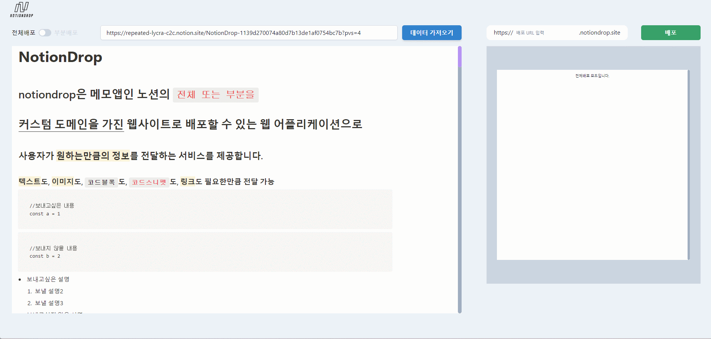
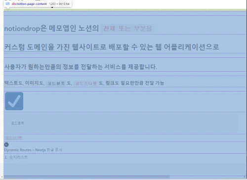
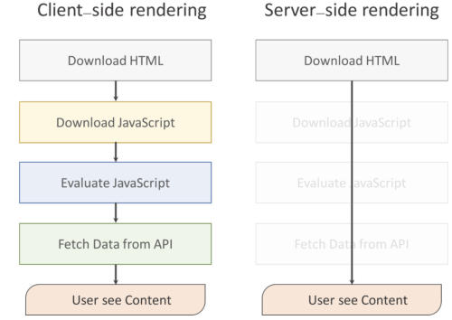
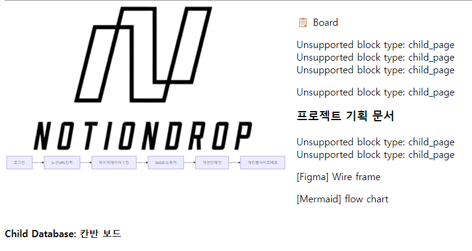
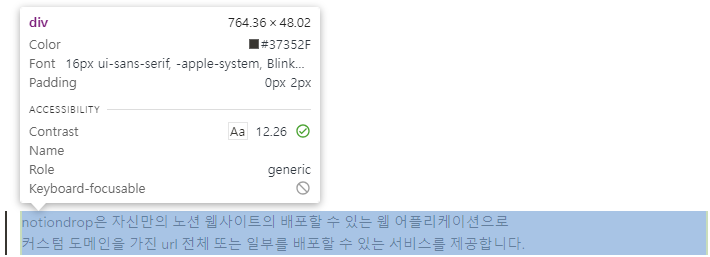
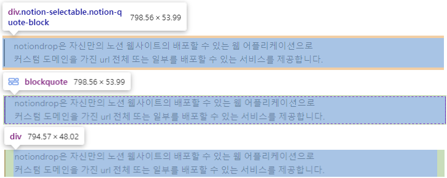
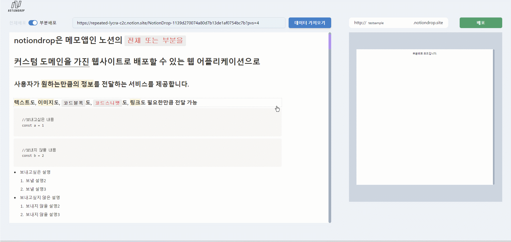

# NotionDrop

메모앱인 노션의 페이지 **전체 또는 부분을 배포**하여 사용자가 원하는만큼의 정보를 **정적 웹페이지로** 전달하는 서비스를 제공합니다.

| 사용예시) 노션 컨텐츠 중 원하는 블럭만 선택하여 배포 → [예시 샘플 확인하기](http://testsample.notiondrop.site) |
| -------------------------------------------------------------------------------------------------------------- |
|                                                            |

  
  
  
  
  
   
  
  
  
  
    

<a href="http://notiondrop.eba-a7ppf4xy.ap-northeast-2.elasticbeanstalk.com/">배포 링크 바로가기</a>

## 목차

- [1. 기획동기](#1-%EA%B8%B0%ED%9A%8D%EB%8F%99%EA%B8%B0)

- [2. 핵심기술 개요](#2-%ED%95%B5%EC%8B%AC%EA%B8%B0%EC%88%A0-%EA%B0%9C%EC%9A%94)

  - [2-1. Next.js의 App router 구조로 프로젝트를 설계한 이유](#2-1-nextjs%EC%9D%98-app-router-%EA%B5%AC%EC%A1%B0%EB%A1%9C-%ED%94%84%EB%A1%9C%EC%A0%9D%ED%8A%B8%EB%A5%BC-%EC%84%A4%EA%B3%84%ED%95%9C-%EC%9D%B4%EC%9C%A0)
  - [2-2. 노션에 기록된 내용을 SSR방식으로 렌더링해서 가져오기](#2-2-%EB%85%B8%EC%85%98%EC%97%90-%EA%B8%B0%EB%A1%9D%EB%90%9C-%EB%82%B4%EC%9A%A9%EC%9D%84-ssr%EB%B0%A9%EC%8B%9D%EC%9C%BC%EB%A1%9C-%EB%A0%8C%EB%8D%94%EB%A7%81%ED%95%B4%EC%84%9C-%EA%B0%80%EC%A0%B8%EC%98%A4%EA%B8%B0)
  - [2-3. 부분 배포 기능 구현 시 선택한 블럭만 지정해서 SSG 방식으로 생성하기](#2-3-%EB%B6%80%EB%B6%84-%EB%B0%B0%ED%8F%AC-%EA%B8%B0%EB%8A%A5-%EA%B5%AC%ED%98%84-%EC%8B%9C-%EC%84%A0%ED%83%9D%ED%95%9C-%EB%B8%94%EB%9F%AD%EB%A7%8C-%EC%A7%80%EC%A0%95%ED%95%B4%EC%84%9C-ssg-%EB%B0%A9%EC%8B%9D%EC%9C%BC%EB%A1%9C-%EC%83%9D%EC%84%B1%ED%95%98%EA%B8%B0)
    - [[1] SSG 방식의 성능적 이점](#1-ssg-%EB%B0%A9%EC%8B%9D%EC%9D%98-%EC%84%B1%EB%8A%A5%EC%A0%81-%EC%9D%B4%EC%A0%90)
    - [[2] SSG 방식의 기술적 이점](#2-ssg-%EB%B0%A9%EC%8B%9D%EC%9D%98-%EA%B8%B0%EC%88%A0%EC%A0%81-%EC%9D%B4%EC%A0%90)
  - [2-4. Vercel을 활용하여 서브도메인 부여하기](#2-4-vercel%EC%9D%84-%ED%99%9C%EC%9A%A9%ED%95%98%EC%97%AC-%EC%84%9C%EB%B8%8C%EB%8F%84%EB%A9%94%EC%9D%B8-%EB%B6%80%EC%97%AC%ED%95%98%EA%B8%B0)

- [3. 구현 세부 사항](#3-%EA%B5%AC%ED%98%84-%EC%84%B8%EB%B6%80-%EC%82%AC%ED%95%AD)

  - [3-1. 깔끔하게 노션 컨텐츠 가져오기](#3-1-%EA%B9%94%EB%81%94%ED%95%98%EA%B2%8C-%EB%85%B8%EC%85%98-%EC%BB%A8%ED%85%90%EC%B8%A0-%EA%B0%80%EC%A0%B8%EC%98%A4%EA%B8%B0)
    - [[1] 노션 컨텐츠를 못 가져오는 노션API](#1-%EB%85%B8%EC%85%98-%EC%BB%A8%ED%85%90%EC%B8%A0%EB%A5%BC-%EB%AA%BB-%EA%B0%80%EC%A0%B8%EC%98%A4%EB%8A%94-%EB%85%B8%EC%85%98api)
    - [[2] `Puppeteer`의 "스냅샷"으로 구현한 SSR](#2-puppeteer%EC%9D%98-%EC%8A%A4%EB%83%85%EC%83%B7%EC%9C%BC%EB%A1%9C-%EA%B5%AC%ED%98%84%ED%95%9C-ssr)
  - [3-2. 부분 배포 기능 구현 시 직관적으로 블럭을 선택하는 기준](#3-2-%EB%B6%80%EB%B6%84-%EB%B0%B0%ED%8F%AC-%EA%B8%B0%EB%8A%A5-%EA%B5%AC%ED%98%84-%EC%8B%9C-%EC%A7%81%EA%B4%80%EC%A0%81%EC%9C%BC%EB%A1%9C-%EB%B8%94%EB%9F%AD%EC%9D%84-%EC%84%A0%ED%83%9D%ED%95%98%EB%8A%94-%EA%B8%B0%EC%A4%80)
    - [[1] 블럭을 정확하게 선택하는 방법](#1-%EB%B8%94%EB%9F%AD%EC%9D%84-%EC%A0%95%ED%99%95%ED%95%98%EA%B2%8C-%EC%84%A0%ED%83%9D%ED%95%98%EB%8A%94-%EB%B0%A9%EB%B2%95)
    - [[2] 노션의 계층적 블럭 구조 활용 → 상위 블럭 선택시 하위블럭까지 포함](#2-%EB%85%B8%EC%85%98%EC%9D%98-%EA%B3%84%EC%B8%B5%EC%A0%81-%EB%B8%94%EB%9F%AD-%EA%B5%AC%EC%A1%B0-%ED%99%9C%EC%9A%A9-%E2%86%92-%EC%83%81%EC%9C%84-%EB%B8%94%EB%9F%AD-%EC%84%A0%ED%83%9D%EC%8B%9C-%ED%95%98%EC%9C%84%EB%B8%94%EB%9F%AD%EA%B9%8C%EC%A7%80-%ED%8F%AC%ED%95%A8)
        [+ 확장성에 대한 고민 : 좀 더 다양한 방법 적용(Drag & Drop, Positive / Negative)](#-%ED%99%95%EC%9E%A5%EC%84%B1%EC%97%90-%EB%8C%80%ED%95%9C-%EA%B3%A0%EB%AF%BC--%EC%A2%80-%EB%8D%94-%EB%8B%A4%EC%96%91%ED%95%9C-%EB%B0%A9%EB%B2%95-%EC%A0%81%EC%9A%A9drag--drop-positive--negative)
  - [3-3. 배포 구성 미리 보기 기능 구현](#3-3-%EB%B0%B0%ED%8F%AC-%EA%B5%AC%EC%84%B1-%EB%AF%B8%EB%A6%AC-%EB%B3%B4%EA%B8%B0-%EA%B8%B0%EB%8A%A5-%EA%B5%AC%ED%98%84)
    - [[1] 사용자 편의를 고려한 배포 미리 보기 기능](#1-%EC%82%AC%EC%9A%A9%EC%9E%90-%ED%8E%B8%EC%9D%98%EB%A5%BC-%EA%B3%A0%EB%A0%A4%ED%95%9C-%EB%B0%B0%ED%8F%AC-%EB%AF%B8%EB%A6%AC-%EB%B3%B4%EA%B8%B0-%EA%B8%B0%EB%8A%A5)
    - [[2] `useState`만으로 실시간 미리보기 렌더링 구현](#2-usestate%EB%A7%8C%EC%9C%BC%EB%A1%9C-%EC%8B%A4%EC%8B%9C%EA%B0%84-%EB%AF%B8%EB%A6%AC%EB%B3%B4%EA%B8%B0-%EB%A0%8C%EB%8D%94%EB%A7%81-%EA%B5%AC%ED%98%84)
  - [3-4. retry 패턴을 응용한 polling으로 SSL 인증 안정성 확보](#3-4-retry-%ED%8C%A8%ED%84%B4%EC%9D%84-%EC%9D%91%EC%9A%A9%ED%95%9C-polling%EC%9C%BC%EB%A1%9C-ssl-%EC%9D%B8%EC%A6%9D-%EC%95%88%EC%A0%95%EC%84%B1-%ED%99%95%EB%B3%B4)
    - [[1] Vercel이 제공하는 LetsEncrypt를 이용한 SSL인증서 등록 과정 중 겪게 된 SSL인증서 등록 지연 현상](#1-vercel%EC%9D%B4-%EC%A0%9C%EA%B3%B5%ED%95%98%EB%8A%94-letsencrypt%EB%A5%BC-%EC%9D%B4%EC%9A%A9%ED%95%9C-ssl%EC%9D%B8%EC%A6%9D%EC%84%9C-%EB%93%B1%EB%A1%9D-%EA%B3%BC%EC%A0%95-%EC%A4%91-%EA%B2%AA%EA%B2%8C-%EB%90%9C-ssl%EC%9D%B8%EC%A6%9D%EC%84%9C-%EB%93%B1%EB%A1%9D-%EC%A7%80%EC%97%B0-%ED%98%84%EC%83%81)
    - [[2] Retry 패턴을 응용하여 polling 구현](#2-retry-%ED%8C%A8%ED%84%B4%EC%9D%84-%EC%9D%91%EC%9A%A9%ED%95%98%EC%97%AC-polling-%EA%B5%AC%ED%98%84)

- [4. 회고](#4-%ED%9A%8C%EA%B3%A0)

   

# 1. 기획동기

누군가에게 양질의 정보를 전달해주는 것은 꽤나 가슴뛰는 경험이라고 생각합니다.

이 프로젝트는 메모앱인 노션의 페이지 공유 기능인 "게시하기"에서 영감을 받아, 현재 노션에서 지원되는 페이지 전체 공유하는 방식에 다양화를 더해 **전체 뿐 아니라 페이지의 원하는 부분만 선택해서 배포할 수 있는 기능을 구현**한 프로젝트 입니다.

개발 공부를 시작하며 알게된 노션은 무엇보다 간편함이 매력이었고, 자료를 정리하기도, 공유하기도 꽤 유용했습니다만, 사용하며 정보전달 방법이 너무 단일적이라는 생각이 들었습니다.

노션은 이미 “게시하기” 기능으로 충분히 정보를 전달하기에 유용하지만, 너무 간편한 탓에 익숙하지 않은 사용자는 보내고 싶지 않은 정보까지 보내게 될때도 있었고(하위페이지, 상위페이지를 의도치 않게 포함), 보내고 싶은 부분만 보내는 것 또한 코드블럭, 코드조각 등의 마크다운형식의 문법 사용으로 인해 메신저 등 다른 방법으로 공유하기에는 동일한 형식으로 전달되지않는 찝찝함 또한 있었습니다.

위 부분의 사용성을 개선하고자 이 프로젝트를 기획하게 되었고, 과잉 정보 속에 핵심 정보만 명확하고 정확하게 전달하고자 하는 마음을 담아 2주간 집중해서 제작해보았습니다.

  

# 2. 핵심기술 개요

노션 컨텐츠(글, 이미지, 링크 등)의 전체 또는 부분을 배포하는 기능 구현을 위해 아래의 항목을 핵심 기술로 정의하고 구현하였습니다.

1. 노션에 기록한 모든 컨텐츠를 동일한 형태로 온전하게 가져올 것
2. 가져온 노션 컨텐츠는 모두 개별 선택이 가능한 상태로 만들 것
3. 선택한 컨텐츠만으로 구성하여 페이지 생성이 가능하게 할 것

프로젝트의 첫걸음은 **사용자의 입장에서 어떻게 노션 컨텐츠를 보여주는게 가장 익숙하고 직관적일지**에 대한 고민이었습니다.
노션의 구조는 일반적인 메모장처럼 줄 단위로 이루어져 있고, 노션에서는 이를 '블럭' 이라고 지칭하고 있습니다.

따라서 블럭 단위로 선택하는 것이 가장 직관적이라고 생각했고, 웹 기반으로 이루어져있는 노션의 블럭은 `data-block-id`속성을 가진 `
`태그로 구성되어 있었습니다.

 

|                        |
| ------------------------------------------------------------------------------------ |
| 노션 사용자가 한줄 한줄 입력하는 내용은 하나의 html '블럭' 으로 구성되어 있었습니다. |

 

이미 노션으로 작성이 완료된 정적인 html을 가져오는 방식은 단연 **SSR 방식**을 사용하는 것이 가장 효과적이라고 판단을 했고, 배포하여 다른 사람에게 공유하는 상태에서는 매번 렌더링할 필요는 없다고 판단하여 **SSG 방식**을 활용하여 구현해보았습니다.

핵심 기술인 `SSR`과 `SSG`를 효과적으로 사용하기 위해, 프로젝트의 개발 구조는 Next.js의 App router 구조로 설계하였습니다.

 

## 2-1. Next.js의 App router 구조로 프로젝트를 설계한 이유

풀스택 프레임워크인 Next.js의 App router 구조는 `SSR`과 `SSG`를 활용하는 프로젝트에 그야말로 '최적' 이었습니다.

App router가 '최적'이라고 판단되었던 대표적인 2가지 이유는 아래와 같습니다.

- App router 구조는 기본적으로 렌더링을 할 때 SSG방식으로 렌더링 합니다.
- Page Router 구조에서는 지원되지 않는 React Server Components와의 통합을 지원하여, 서버에서 데이터를 처리하고 렌더링하여 클라이언트로 전송하는 작업이 더욱 효율적으로 이루어집니다. 이를 통해 클라이언트 측에서 불필요한 자바스크립트 번들을 줄이고, 성능 향상을 기대할 수 있습니다.

또한 파일 및 디렉토리 구조 관리에서도 페이지 별로 폴더를 만들고, 그 내부에 레이아웃, 에러 처리, 로딩 상태 등을 쉽게 설정할 수 있는 구조를 제공하고, 병렬 라우팅 방식을 통해 프로젝트의 구성이나 화면 표시에 있어 학습하기에 직관적이여서 적용하기에 용이했습니다.

 

## 2-2. 노션에 기록된 내용을 SSR방식으로 렌더링해서 가져오기

 

클라이언트에서 html블럭을 일일이 렌더링한다면 통신 등의 외부 환경이나 상황에 따라 온전한 렌더링이 이루어지지 않을 수도 있기에 서버에서 **노션 블럭과 동일한 html파일을 렌더링하는 SSR방식**으로 노션블럭을 렌더링했습니다.

 

 

위 방법으로 클라이언트가 페이지를 요청했을 때 즉시 렌더링된 html을 받아볼 수 있었으며, 클라이언트의 리소스를 절약하고 더 빠르게 렌더링된 블럭을 확인할 수 있었습니다.

 

## 2-3. 부분 배포 기능 구현 시 선택한 블럭만 지정해서 SSG 방식으로 생성하기

### [1] SSG 방식의 성능적 이점

 

 

사용자가 부분 배포 모드를 선택한 경우, 선택된 블럭만으로 구성된 웹 페이지를 빌드하여 배포하고자 했고, 여기에서 **SSG**방식을 사용한다면 장기적인 관점에서 렌더링 비용을 줄일 수 있습니다.

SSG의 특징은 **빌드 시점에 한번만 렌더링하기에 매 요청마다 렌더링 하지 않아도 되고, 이를 통해 생성된 html파일을 CDN(Content Delivery Network) 서버에 저장**할 수 있기 때문에 매 요청마다 서버에서 렌더링이 발생하게 되는 SSR에 비해 서버 부하를 줄일 수 있습니다.

그리고 서버보다 가까운 CDN에 요청하여 만들어진 정적 페이지를 수신받기만 하면 되기에 페이지 로딩도 렌더링 과정이 포함된 SSR의 경우보다 당연히 빠릅니다.

그렇기에 노션 페이지를 보는 것과 동일한 경험을 제공할 수 있고, 정적으로 필요한 정보를 전달하기에 효율적이라고 판단해 사용했습니다.

### [2] SSG 방식의 기술적 이점

또한 이 프로젝트는 App router 구조를 사용했기에, 더욱 간단하게 SSG를 구현할 수 있었습니다.

 

|  |
| --------------------------------------------------------------------- |

 

[Next.js 공식문서](https://nextjs.org/docs/app/building-your-application/rendering/server-components#switching-to-dynamic-rendering)의 위 한 줄이 의미하는 바는 아래와 같습니다.

- App Router는 기본적으로 SSG로 렌더링 되고 캐싱되지 않은 동적 함수를 찾으면 자동으로 내부에서 SSR을 채택합니다.
- 렌더링 작업을 청크로 쪼개어 효율적으로 렌더링하는 '스트리밍' 기능도 내장되어 있어 자동 적용됩니다.

이 장점을 그대로 활용하여 구현하였고, Next.js를 제작한 Vercel에서 SSG를 생성하고 배포하는 서비스를 제공하고 있었기에 이를 통해 사용자가 선택한 배포 구성에 따라 SSG를 생성하고 배포하도록 했습니다.

 

## 2-4. Vercel을 활용하여 서브도메인 부여하기

사용자가 `mypage.notiondrop.site` 와 같이 고유의 서브도메인을 설정하면, 해당 URL로 다른 사람에게 공유할 수 있도록 공유 방식을 제공하였습니다.

서브도메인 부여는 Vercel API를 통해 자동화되어 있으며, 사용자들은 복잡한 설정 없이 단순한 입력만으로 빠르게 웹사이트를 배포할 수 있게 하였습니다.

현재는 로그인 등의 개인정보 관리 시스템은 구축되어 있지 않으나, 추후 필요 시 로그인을 통해 자신이 배포한 페이지 리스트를 제공할 수 있게 하여 간편하게 관리할 수 있는 시스템도 고려중입니다.

  

# 3. 구현 세부 사항

## 3-1. 깔끔하게 노션 컨텐츠 가져오기

### [1] 노션 컨텐츠를 못 가져오는 노션API

처음에는 노션API를 사용해 노션 페이지의 컨텐츠를 가져오는 방식을 고려하였는데, 노션API의 한계점이 명확하여 **극복이 어려운 부분**이 있었습니다.

 

- 특정 블럭(데이터베이스, 토글, Mermaid 등 일부 코드 블럭)이 제대로 렌더링되지 않았습니다.
- OAuth인증, 권한 관리와 같은 복잡한 절차가 필요했습니다.

 

렌더링에 있어 노션API의 한계점은 노션에 기록된 내용을 JSON형식으로 가져온다는 점이었고, 따라서 JSON형식으로 되어있는 데이터를 다시 html블럭으로 만드는 작업이 필요했습니다.

이 때 기존 노션 페이지에서 보이는 것처럼 만드려면 텍스트, 이미지, 코드블럭 등 모든 블럭마다 재현시키기 위한 css속성이 모두 다른게 문제점이었고, 이 방법은 블럭마다 1:1 대응으로 css속성을 지정해줄 수 밖에 없는 처리방법이라 확장성 또한 없다는 생각이 들었습니다.

또한 API사용을 위해 인증, 권한관리가 필요한 상황은 노션의 “게시하기” 기능보다 간단한 공유를 기획한 것과 매우 상반된 상황이었고, 이는 사용자 경험 저하 뿐 아니라 기획의도와도 맞지 않다고 생각했습니다.

 

### [2] `Puppeteer`의 "스냅샷"으로 구현한 SSR

그래서 본질적으로 제가 원하는 결과를 다시 되짚어 보았습니다. 제가 구현하고 싶은건 **원본 노션과 동일한 모양의 html블럭**이었습니다. 즉, 웹 기반의 노션 페이지에 나타난 형태를 그대로 가져오면 되는 것이었으므로, 태그 형태를 그대로 가져올 수 있는 방법을 조사해보았고, 그 중 `Puppeteer`를 사용하는 방법이 가장 눈에 들어왔습니다.

`Puppeteer`는 백그라운드에서 작동하는 브라우저인 헤드리스 브라우저를 제어하는 라이브러리로, 보이는 화면은 없지만 실제로 표시되는 화면처럼 브라우저 구성요소를 조작할 수 있었습니다. 그 조작 방법 중 "스냅샷"이 html블럭을 동일한 형태로 가져오기 적절하다고 판단하였습니다.

 

| **[노션API를 사용한 경우]**                                 | **[Puppeteer를 사용한 경우]**                                |
| ----------------------------------------------------------- | ------------------------------------------------------------ |
|  |  |

기존에 노션 API로 가져오던 방식에서 Puppeteer를 사용하여 헤드리스 브라우저에서 입력한 노션url 페이지를 렌더링한 후, 해당 페이지를 html로 변환해 가져오는 방식으로 변경했습니다. 이 방식은 **노션 API 사용방식의 단점을 완벽히 극복하는 방법**이었습니다.

 

- 노션 페이지의 모든 블럭을 정확하게 렌더링할 수 있었습니다. 즉, 노션의 상위-하위 블럭 관계, 데이터베이스, 그리고 칸반 같은 복잡한 구성도 정확하게 처리할 수 있었습니다.
- OAuth인증, 권한 관리와 같은 사용자에게 부차적인 불편을 제공하지 않을 수 있었습니다.

 

스냅샷 방식은 노션API를 사용하는 방식으로는 얻을 수 없는 **일관성 있는 렌더링을 제공**하며, 이는 배포된 페이지가 원본 노션의 구조를 동일한 화면을 제공하여 사용자에게 더 **직관적인 웹사이트를 제공**합니다. 이는 노션API 사용 방식과 비교했을 때, 사용자 경험을 크게 개선할 수 있는 장점이 있었습니다.

 

## 3-2. 부분 배포 기능 구현 시 직관적으로 블럭을 선택하는 기준

### [1] 블럭을 정확하게 선택하는 방법

프로젝트에서 구현한 부분 배포 기능은 사용자가 특정 블럭만 선택해 웹사이트로 배포할 수 있도록 설계하였습니다.

`
`로 구성된 노션 컨텐츠를 선택할 수 있게 구현하였는데 가끔 블럭을 선택해도 의도한대로 선택이 되지 않은 경우가 있어 원인을 파악해보니, 이유는 노션의 깔끔한 인터페이스때문이었습니다.

노션의 깔끔한 인터페이스는 보이지 않는 수많은 `
`의 덕분이었는데, 컨텐츠가 포함된 블럭을 선택한 것처럼 보여도 레이아웃의 역할을 하는 `
`였다면 아무 내용도 담기지 않는 결과가 발생된 것이어서, 실제 컨텐츠와 레이아웃을 역할을 하는 블럭을 모두 포함시켜 하나의 '블럭'으로 기준을 만들었습니다.

 

| **[실제 컨텐츠가 들어있는 `
`]**                      | **[해당 `
`의 레이아웃 역할을 하는 `
`들]**       |
| --------------------------------------------------------- | --------------------------------------------------------- |
|  |  |

> 만약 선택한 블럭이 레이아웃 역할의 블럭이라면 실제 기록한 내용이 배포 구성에 포함되지 않았습니다.

시각적으로 한 줄에 모든 블럭이 겹쳐있는 모양이니, 노션 컨텐츠를 모두 포함하는 최상위 블럭인 [`notion-page-content`](https://github.com/heestolee/notiondrop/blob/main/public/image/notion-content-select.png)의 한 단계 아래 계층의 `
`를 하나의 블럭으로 정의하여 사용자가 의도한대로 블럭이 선택되도록 구현하였습니다.

 

### [2] 노션의 계층적 블럭 구조 활용 → 상위 블럭 선택시 하위블럭까지 포함

단일 블럭 단위로 선택이 가능해진 이후, 조금 더 사용 경험을 높이고 싶어 여러 방법을 더 만들어보고자 했습니다. 그 중 가장 먼저 구현해본 기능은 노션 컨텐츠의 상위 블럭을 선택하면 하위 블럭이 모두 선택되도록 하는 방식입니다.

노션의 컨텐츠는 보통 인덴팅(들여쓰기)으로 여러 내용을 체계적으로 작성할 수 있는데, 이 인덴팅이 되어있는 전체 블럭을 한 번의 클릭으로 모두 포함하게 하였습니다.

 

| **[개별 블럭 선택]**                                | **[최상위 블럭만 선택]**                                |
| --------------------------------------------------- | ------------------------------------------------------- |
|  |  |

이 방식은 계층 구조를 활용하여 사용자에게 편의성을 제공하고, 특정 상황에 선택 과정을 최소화하여 사용 경험을 개선하게 되었다고 생각합니다.

 

### + 확장성에 대한 고민 : 좀 더 다양한 방법 적용(Drag & Drop, Positive / Negative)

위에서 적용해본 방식의 의도는 **어떻게 하면 사용자가 더 편리하게 배포에 포함시킬 블럭을 선택할 수 있을까?**에서 출발한 아이디어였습니다. 위 방법은 분명 일일이 모든 블럭을 선택해야하는 상황보다 편리하겠지만, 사용자의 사용 의도에 따라 다른 방법들이 더 편할수도 있다는 생각 또한 들었습니다. 예를 들면,

 

- 전체 블럭 중 일부만 제외하고 보내고 싶은 경우
- 한 번의 클릭으로 연속된 여러 블럭을 선택하고 싶은 경우

 

개선 방향으로는 `<Positive / Negative>` 방식을 추가하여 더 유연한 선택 방식을 제공하는 것을 검토하고 있습니다. Positive 방식은 기본적으로 아무 블럭도 선택되지 않은 상태에서 필요한 블럭만 추가하는 방식이며(현재 구현한 방법), Negative 방식은 기본적으로 모든 블럭을 선택한 상태에서 배포하지 않을 블럭을 제외하는 방식입니다.

그리고 `<Drag & Drop>` 방법도 고려중인데, 이는 1번의 클릭으로 연속된 여러 블럭을 선택할 때 가장 직관적인 방식이라 생각하여 구현된다면 사용자는 더 세밀한 선택 옵션을 갖게 되고, 더욱 더 사용자 경험을 향상시키는 요소가 될거라 생각합니다.

 

## 3-3. 배포 구성 미리 보기 기능 구현

### [1] 사용자 편의를 고려한 배포 미리 보기 기능

프로젝트에서 부분 배포 기능 구현 시 사용자가 노션 페이지에서 원하는 블럭만 선택하여 배포 내용을 구성할 수 있도록 구현했지만, 사용자가 **선택한 블럭을 배포 전에 어떻게 미리 확인할 수 있을지** 고민이 되는 지점이 있었습니다.

물론 부분 배포할 블럭을 선택하면 하이라이트 표시로 인식이 가능하지만, 사용자의 입장에서 배포되는 구성을 한눈에 볼 수 있어야 만족감이 더 좋을거라 생각했습니다.

특히 이 고민을 하면서 중점적으로 생각한 부분은, 사용자가 선택한 블럭들이 배포될 페이지와 동일한 형태로 정확하게 미리보기 화면에 나타나야 하며, 사용자의 혼동을 줄이기 위해 선택된 순서와 상관없이 원래 노션 페이지의 블럭 순서대로 표시될 필요가 있다고 생각했었습니다.

 

### [2] `useState`만으로 실시간 미리보기 렌더링 구현

미리보기화면은 실시간으로 확인할 수 있는게 가장 사용자 만족감이 높을거라 생각했고, 블럭 선택과 동시에 실시간으로 반영을 시키기 위해 부모 컴포넌트에서 `useState`로 상태를 관리하고 전달하면 되겠다고 생각했습니다.

 

배포될 블럭을 실시간으로 미리보기 화면에 반영하기 위해, html블럭 선택 상태를 `useState`에 배열로 저장하고, 원래 노션 페이지의 순서를 유지하도록 구현했습니다.

또한 매번 업데이트될 때마다 블럭들을 오름차순으로 정렬하도록 하여 실제 배포 페이지에 보이는 블럭 순서대로 미리보기 화면에 나타나도록 구현했습니다.

이를 통해 사용자는 선택한 블럭이 실제로 어떻게 배포될지를 직관적으로 확인할 수 있게 하고, 빈번한 상태 업데이트로 인한 성능 저하를 줄이기 위해 `useMemo`를 사용하여 불필요한 리렌더링을 방지했습니다.

## 3-4. retry 패턴을 응용한 polling으로 SSL 인증 안정성 확보

### [1] Vercel이 제공하는 LetsEncrypt를 이용한 SSL인증서 등록 과정 중 겪게 된 SSL인증서 등록 지연 현상

Vercel은 LetsEncrypt라는 서비스를 제공하여 배포 시 자동으로 SSL 인증서 등록을 해줍니다.

SSL 인증서를 등록을 대신 작업해주는건 감사한 일이었으나, 즉시 발급이 되는 경우도 있었고 간혹 수 십초 정도 발급이 지연되는 경우도 있었기 때문에 일관성있는 결과를 제공할 필요를 느꼈습니다.

 

|                                                 |
| --------------------------------------------------------------------------------------- |
| 배포가 완료되어도 페이지에 접근을 못하고 SSL 인증서 등록을 기다려야 할 때도 있었습니다. |

 

배포되는 즉시 사용자에게 페이지를 제공하면 간혹 보안 위협이 있는 불완전한 웹 페이지를 제공할 수도 있으니, SSL 인증서 등록이 완료된 후 제공하는 방법이 있는지 확인해보았고 아쉽게도 Vercel 서비스 중 SSL 인증서 등록을 확인해주는건 없었기 때문에, 직접 이를 확인하는 로직을 구현해야 했습니다.

 

### [2] Retry 패턴을 응용하여 polling 구현

polling은 일정한 주기로 서버와 응답을 주고 받아 특정 조건을 만족할 때 송수신 등의 자료 처리를 하는 방식입니다.

보통 클라이언트와 서버 사이에 사용하는 경우가 일반적이지만, 이미 클라이언트에서 API 라우트에 요청을 보내 페이지를 배포하는 작업을 하고 있었기 때문에 굳이 클라이언트로 돌아와 polling을 적용하는 것보다 서버에서 페이지 배포 후 SSL 등록이 완료됨을 확인하고 한번에 클라이언트로 응답을 보내는 것이 더 효율적이라고 판단했습니다.

 

 

그래서 서버에서 delay나 timeout등의 경우에 사용하는 retry패턴을 응용하여 polling 로직을 구현하고, SSL등록이 완료되어 배포된 페이지에 안전하게 접근 가능하게 되었을 때 클라이언트로 응답을 보내 사용자에게 링크를 제공하도록 구현하였습니다.

  

# 4. 회고

이번 프로젝트를 통해 Next.js의 App Router 방식으로 프로젝트 시작부터 끝까지 구현을 하며 단순히 React Server Component를 지원하는 프레임워크를 다뤄본 것 이상으로 **SSR, SSG 방식의 렌더링을 하는 방식에 여러 구조적 이점에 대해 깊은 이해를 얻게 된 과정**이었다고 생각합니다.

Next.js를 사용해 SSG를 생성하고 배포하는 프로젝트를 구현해가는 과정에서, 조사하며 발견한 대부분의 레퍼런스는 Page Router 방식을 사용하고 있었습니다.

Page Router 방식으로 구현된 프로젝트의 핵심 기술은 `getStaticProps` 메서드를 활용하여 구현하는게 일반적이지만, App Router 방식에서는 `getServerSideProps`나 `getStaticProps` 같은 메서드를 사용할 수 없었습니다. 이 때문에 데이터를 직접 `fetch`로 가져오고, html태그를 모아 정적 사이트를 생성하는 과정을 설계해야 했습니다.

레퍼런스가 없는 상황에서도 위에서 서술한 App router의 여러 장점들을 공식 문서를 통해 차근차근 공부해가며 구현하는 재미가 있었고, 이 과정에서 특히 React Server Component, React Client Component의 특징과 서로가 어떤 차이점이 있는지 이해하게 되면서 렌더링 동작방식에 대해 실제 적용을 통해 더 와닿게 알게 되어 Next.js에 대해서도, React에 대해서도 조금 더 동작방식에 대해 익숙해진 계기가 되었습니다.
